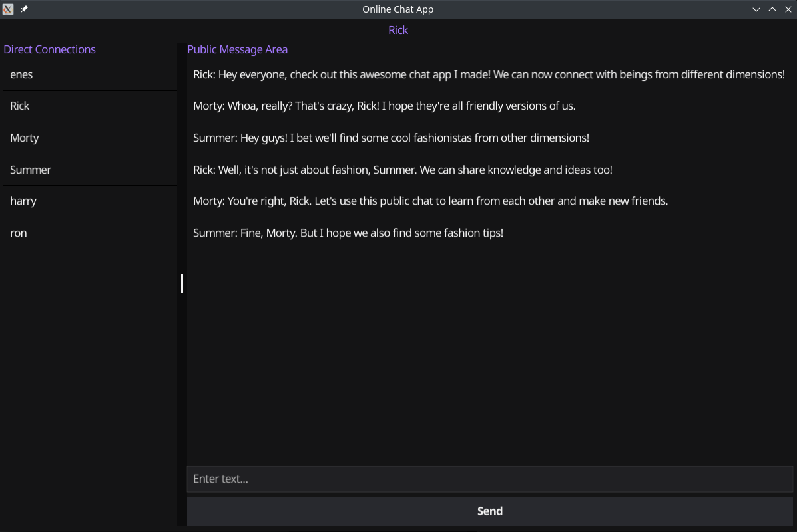
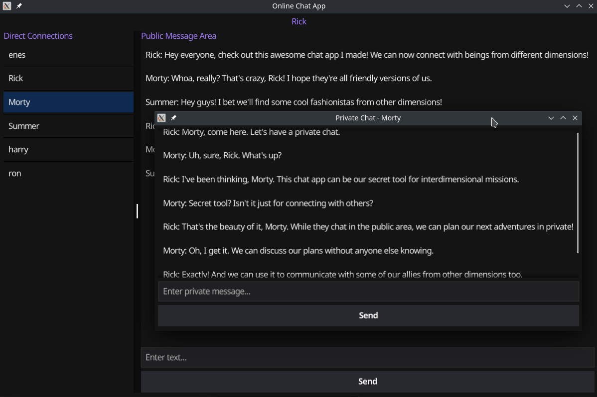
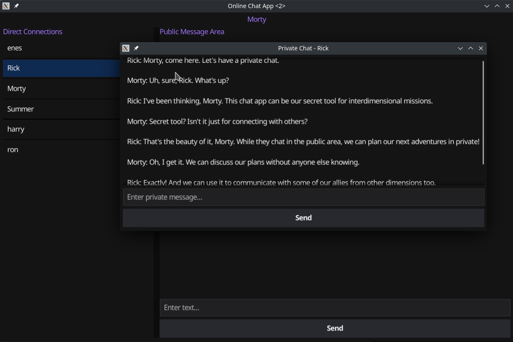
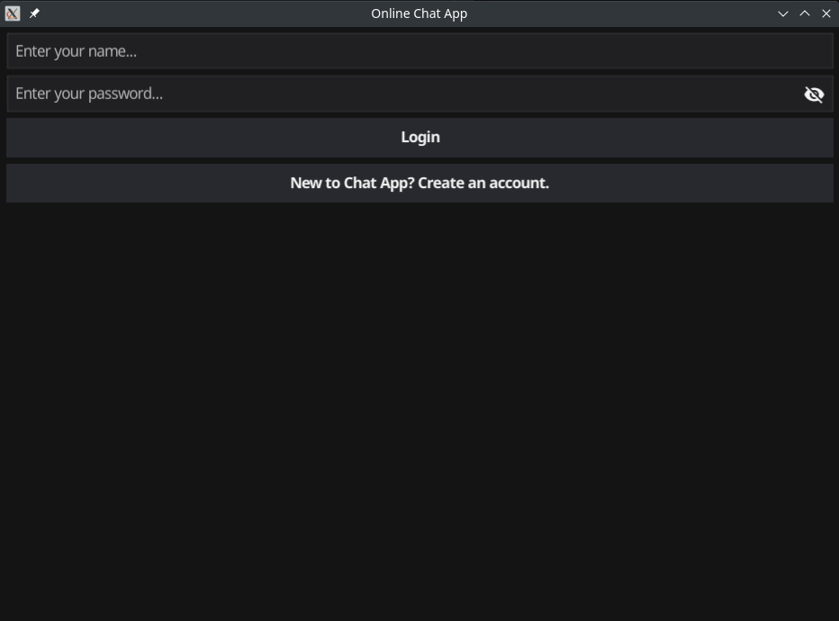
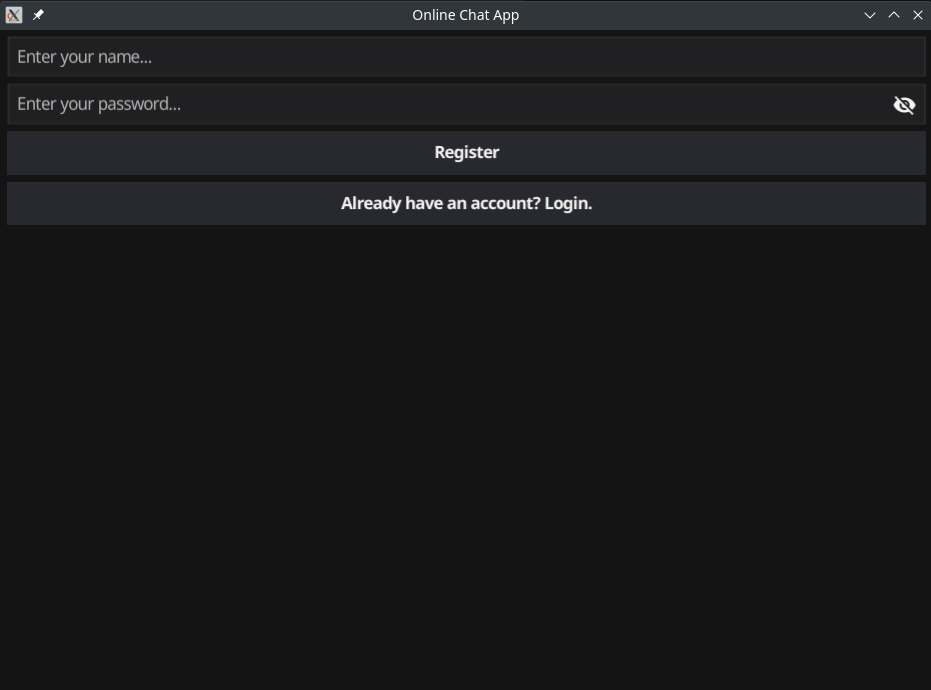

# GoChatty

This is an online chat desktop application. In this application,
- you can login or create an account,
- you can text in the public message area with all users,
- you can text in the private message area with a specific user,

## Packages which I used

- [fyne](https://fyne.io/)
- [gorm](https://gorm.io/)
- [godotenv](https://github.com/joho/godotenv)

## Screenshots

> Public message area

> Private message area

> Login & register pages of the application

